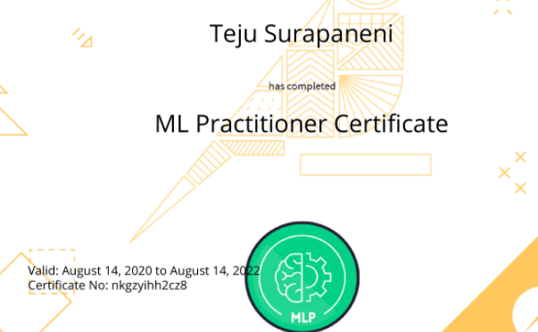

## My Journey of Data Science
<hr> 

## Certifications 
<hr> 


<table border="5" bordercolor="hotpink" align="Center">
    <tr>
        <th colspan="2"> </th> 
    </tr>
    <tr>
        <th>Name</th>
        <th>Certification</th>
    </tr>
    <tr>
                <!-- considering it is on the same folder that .html file -->
        <td border=5 height=100 width=300> <b> AWS Certified Solution Architect - Associate </b> </td>
        <td border=5 height=100 width=300> <a href="https://www.youracclaim.com/badges/ea4effc3-943c-4f0f-b8dc-6afe2cb2dbab" target="_blank">  </td>
    </tr>
    <tr>
        <td border=5 height=100 width=300> <b> Tableau Desktop Specialist </b> </td>
        <td border=5 height=100 width=300> <a href="https://www.youracclaim.com/badges/d9766deb-479f-47fe-9604-aad72bda10ae/linked_in_profile" target="_blank">  </td>
    </tr>
    <tr>
        <td border=5 height=100 width=300> <b> DataIKU Level 1 </b> </td>
        <td border=5 height=100 width=300> <a href="" target="_blank">  </a> </td>
     </tr>
     <tr>
        <td border=5 height=100 width=300> <b> DataIKU Level 2 - Advanced DSS Design and Data Science </b> </td>
        <td border=5 height=100 width=300> <a href="" target="_blank">  </a> </td>
     </tr>
     <tr>
        <td border=5 height=100 width=300> <b> DataIKU ML_Practitioner </b> </td>
        <td border=5 height=100 width=300> <a href="https://verify.skilljar.com/c/nkgzyihh2cz8" target="_blank">  </a> </td>
     </tr>  
     <tr>
        <td border=5 height=100 width=300> <b> DataIKU Core_Designer </b> </td>
        <td border=5 height=100 width=300> <a href="https://verify.skilljar.com/c/si5i4zj89mrz" target="_blank">  </a> </td>
     </tr>  
     

     
</table>

<a href="https://www.youracclaim.com/badges/ea4effc3-943c-4f0f-b8dc-6afe2cb2dbab" target="_blank">  </a> &nbsp; &nbsp; &nbsp; &nbsp; 
<a href="https://www.youracclaim.com/badges/d9766deb-479f-47fe-9604-aad72bda10ae/linked_in_profile" target="_blank">  </a> &nbsp; &nbsp; &nbsp; &nbsp; 
<a href="" target="_blank">  </a> &nbsp; &nbsp; &nbsp; &nbsp; 
<a href="" target="_blank">  </a> &nbsp; &nbsp; &nbsp; &nbsp; 
<a href="" target="_blank">  </a> &nbsp; &nbsp; &nbsp; &nbsp; 
<a href="https://verify.skilljar.com/c/nkgzyihh2cz8" target="_blank">  </a> &nbsp; &nbsp; &nbsp; &nbsp; 
<a href="" target="_blank">  </a> &nbsp; &nbsp; &nbsp; &nbsp; 
<a href="https://verify.skilljar.com/c/si5i4zj89mrz" target="_blank">  </a> &nbsp; &nbsp; &nbsp; &nbsp; 

## Projects
<hr> 
<p>  &#9757; &nbsp; <a href="#Jira_Project">JIRA Project</a> </p>
<p>  &#127872; &nbsp; <a href="#Anomalies">Computer Vision - Detection of anamolies in the manufacturing industry</a>  </p>
<p>  &#9757; &nbsp; <a href="#Oil_gas">Oil and Gas Project - Seismic, las and tiff</a>  </p>
<p>  &#127872; &nbsp; <a href="#Speech">Conversion of speech to text and populate in the health care form</a>  </p>
<p>  &#9757; &nbsp; <a href="#Plugin">Plugin to Integrate Pega and Dataiku</a> </p>
<p>  &#127872; &nbsp; <a href="#Image">Image Redaction</a>  </p>

<h2 id="Jira_Project">JIRA Project</h2>
<hr>

* We all know that Jira is an Issue and Project tracking software which is used in many organizations to keep a track of multiple components for each project.
* This tool generates an abundance of data for each ticket and surplus for each project. This data is originially retained in the JSON format which is a semi-structured data. 
* Through an API call the data is fetched using the Lambda function followed by the step function which can fetch all the data through multiple iterations and then store the raw data in the S3 bucket. 
* Once all the data is fetched in each iteration there comes the problem of structuring them to derive the useful insights from the data extracted. 
* The data is not just in the semi-structured format but, it has so many intra components where each field is having multiple fields within it and then again multiple and so on. 
* In order to reduce the complexity within it, we aimed at only the components which has to be derived for insightful visualizations at the higher level.
* Using pyspark, glue and sql context, the schema was extracted and extracted the components based on the names and the custom id's per each field. 
* Knowing which custom id specifies what data was a really important task as that broke the complex problem into a tiny pieces which can be easily processed and analyzed further. 


<h2 id="Anomalies">Computer Vision - Detection of anamolies</h2> 
<hr>

*	Worked on the computer vision project which is real time detection of anomalies in the manufacturing steel industry using computer vision techniques and algorithms. 
*	Training the model with the image dataset which is retrieved from the NEU database. Annotating the images (XML) and then training the model with both the raw images and annotated datasets.
*	Researching and implementing algorithms like YOLO, SSD using python, tweaking and tuning the parameters like image width, height, anchor boxes, bounding box width, batch size to get the desired predictions and validating the resulting prediction json file with the score and bounding box parameters. Validating the trained modeled and checked with the original annotation of the model to evaluate how well the model worked. 
*	Writing the test cases for all the predictions of the model and then identifying which model through which parameters yielded the better results which is identifying or classifying the defects well in an image given.
* Working with structured data, writing queries to extract, load and transform the data in SQL, querying in Athena. Implemented data manipulation, wrangling and visualizing the data for building useful and significant insights and empowering them using the dashboards of tableau, Power BI and AWS Quick sight. 
*	Worked on automating the ETL pipelines separately based on the domain data and the structure of it. 

<h2 id="Oil_gas">Oil and Gas Project - Seismic, las and tiff</h2>   
<hr>

*	Working on the industry (O&G) specific data standards and formats of data – seismic (.sgy), LAS and tiff files which are the standard formats for the oil and gas industry where the data is stored in the form of waves and traces not just the unstructured and structured like csv, parquet but also the binary structured files. 
*	Extracted the data from the seismic file which is in the binary structured format and then extracted the essential information like ARN, resource extracted (oil or gas), location, country, county and many more and converted into a structured file. 
*	Extracting the valuable information from the data which includes well location, county, resource extracted from the data files (binary, text, pdf, tiff) and converting the unstructured data into a structured data files (csv, parquet) maintaining the compatibility of all versions of the files extracted and integrating on a single format structure. 
*	Ingesting the data into the elastic search and enhancing the capabilities of searching, querying, visualizing the data in the Kibana dev-tools (dev-endpoint) which helps in retrieving the data based on the search request. 
*	To automate the ETL process by building ETL pipelines, CloudWatch events and s3 object notification are triggered periodically as per the DlaaS architecture which involves extracting and decoding the data in the desired format implemented in the AWS platform. 
*	Integrated the DLQ service to the architecture to tract the reason for the failure of extraction which can be the case of uploading the other file extensions.
*	Created visualizations using Kibana, tableau, Power BI, quick sight to elevate the number of resources, location, county, street and integrated the geospatial effects to highlight the states and country along with the resources.

<h2 id="Speech">Conversion of speech to text and populate in the health care form</h2>   
<hr>

* This project aims at converting the speech to text and then populate the data from the text into the fields in the health care form.
* There are different ways of converting the speech to text and researched on those ways and procedure on how to convert the speech to text and then found out few python packages like pyaudio, speech_recognition etc.
* Although there are multiple ways and packages available in the market for this process of conversion we used assemply ai docs API calls which converted the speech to text within few lines of code.
* We will be given an API token and then the speech files of any format (.wav,.mp3) have to be uploaded to the API with the token authentication which process the input. 
* The output of the transcription of the processing unit status changes from queued to processing and from processing to Completed.
* When the status is changed to completed the output will be displayed with the text which is a conversion from the speech. 
* To extract the required data fields from the text and to populate the extracted data into the form NLP is used.
* Various packages and procedures of NLP are used to extract the relevant text and then fill in the form.

<p>  &#9997;  &nbsp; <b> NOTE:</b> The process and the form are kept confidential as that was done to one of our prestigious client </p>

<h2 id="Plugin">Plugin to Integrate Pega and Dataiku</h2>   
<hr>

* This project aims at integrating 2 platforms - Pega PRPC which is a BPM tool and Dataiku which is a data science platform. 
* The main notion behind this integration is that to implement the machine learnign models on the application data.
* The main challenge is that in Pega BPM we can expose the application API but not the generic API which has the data in regards to all the applications in the tool. As this turned into one of our major concerns and in order to move forward in this development we started with a specific application API initially.
* We exposed the API related to the specific application which was doen to one of our clients and then extracted the data from the REST API.
* In order to fetch the data through API calls and upload into the DataIKU workspace flow, a Plugin has to be developed which does this job perfect in a defined framework. This can be done in a code recipe too in a flow after uploading the data but as we would like to build a proper structured framework which can be a same pipeline to be followed whenever a new application data has to be uploaded from Pega.
* A custom built in plugin is developed using the Python code recipe. After testing in the code notebooks then converted the plugin into the plugin. 
* A plugin in dataiku should have 2 code rceipes which are .py and .json. The python code has the code which is made slightly generic by including the variables which can be called before running the code.
* the .json code provides us the ability to define the parameters to input to the .py code. For instance in the plugin developed in this project, we featured 2 parameters one is to input the API and the other one is to input the format which conveys to which format we would like to convert the data which is fecthed from the API (CSV, XML, more..).
* These parameters helps in receiving the input and then these inputs are taken as variables which are called in the actual .py code and then executed. 
* One of the feature parameter which is used to input the API link, serves the purpose of both generic and specific application data fetching. If in future we were able to expose the generic API which can fetch all the applications data, the plugin is still the same and the input can be varied according the API's which we have to covnert it into. 
* If once we input both these featured parameters ( API link, data format to convert into) they are automatically processed and the output datasets which are converted into the specific formats are displayed in the flow for further processing or for implementing the Machine learning models. 

<h2 id="Image">Image Redaction</h2>   
<hr>

*	This is one of the interesting projects I have worked so far and started with researching on different ways to implement the Image recognition and redaction techniques and finally implemented a model which first classifies the vehicles like shuttles, bus, moto vehicles, trucks and identify the number plates on each vehicle and redact the plate in the video
* This model is implemented on the video where we first converted the video into single frames and then operated on the frames in the text cases and then for a video. Wrote several text cases and maintained the record of where the algorithm isn’t working properly and where it is identifying properly based on several evaluation metrics. 

### Markdown

```markdown
Syntax highlighted code block

# Header 1
## Header 2
### Header 3

- Bulleted
- List

1. Numbered
2. List

**Bold** and _Italic_ and `Code` text

[Link](url) and 
```

For more details see [GitHub Flavored Markdown](https://guides.github.com/features/mastering-markdown/).


